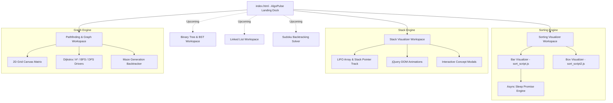

# ⚡ AlgoPulse — Interactive Data Structures & Algorithms Visualizer

[](https://algo-pulse-dsa-visualizer.vercel.app/)
[](#-tech-stack)
[](#-upcoming-modifications--leftover-work)
[](#-contributing--license)

> **AlgoPulse** is a responsive, high-performance browser-based Data Structures and Algorithms (DSA) execution suite. Built to bridge the gap between abstract theoretical logic and physical execution, **AlgoPulse** models pointer transformations, memory partitioning, pathfinding bounds, array mutations, and stack states in real time.

---

## 📌 Table of Contents

- [🌟 What AlgoPulse Does](#-what-algopulse-does)
- [📐 System Architecture](#-system-architecture)
- [📁 Project Directory Layout](#-project-directory-layout)
- [✅ Committed Work & Implemented Modules](#-committed-work--implemented-modules)
  - [📊 1. Sorting Algorithms Visualizer](#1-sorting-algorithms-visualizer)
  - [🥞 2. Stack Implementation Visualizer](#2-stack-implementation-visualizer)
  - [🗺️ 3. Pathfinding & Graph Search Visualizer](#3-pathfinding--graph-search-visualizer)
- [⏱️ Algorithmic Complexity & Specifications Matrix](#%EF%B8%8F-algorithmic-complexity--specifications-matrix)
- [🛠️ Prerequisites](#%EF%B8%8F-prerequisites)
- [💻 Step-by-Step Instructions: How to Run](#-step-by-step-instructions-how-to-run)
  - [Option 1: Direct Local Browser Launch (Simplest)](#option-1-direct-local-browser-launch-simplest)
  - [Option 2: VS Code Live Server Extension](#option-2-vs-code-live-server-extension)
  - [Option 3: Node.js Static Server (`npx serve`)](#option-3-nodejs-static-server-npx-serve)
  - [Option 4: Python HTTP Server](#option-4-python-http-server)
  - [Option 5: Deploying to Vercel](#option-5-deploying-to-vercel)
- [🔮 Leftover Work & Upcoming Modifications](#-leftover-work--upcoming-modifications)
  - [🌳 Module 4: Binary Tree & Binary Search Tree (BST) Visualizer](#-module-4-binary-tree--binary-search-tree-bst-visualizer)
  - [🔗 Module 5: Singly Linked List Visualizer](#-module-5-singly-linked-list-visualizer)
  - [🧩 Module 6: Sudoku Backtracking Visualizer](#-module-6-sudoku-backtracking-visualizer)
  - [🔊 Audio Pitch Synthesis & Audio Feedback](#-audio-pitch-synthesis--audio-feedback)
  - [🌗 Global Theme Switcher & Multi-Language Code Snippet Engine](#-global-theme-switcher--multi-language-code-snippet-engine)
- [🎓 Viva & Code Modification Quick Reference](#-viva--code-modification-quick-reference)
- [🤝 Contributing & License](#-contributing--license)

---

## 🌟 What AlgoPulse Does

Abstract algorithm execution can be difficult to grasp solely through pseudocode or static diagrams. **AlgoPulse** translates low-level array swaps, memory stack pushes/pops, grid node expansions, and pointer jumps into interactive visual step-by-step animations.

### Key Capabilities:
- ⚡ **Non-Blocking Visual Execution Engine**: Implements `async/await` promise delays (`sleep(ms)`) over the JavaScript event loop, ensuring real-time CSS animations and DOM updates without locking up the browser thread.
- 🎨 **Dual Sorting View Modes**: Supports traditional **Vertical Bar Height** visualizers for large random arrays alongside **Numerical Box / Block** visualizers for user-defined array inputs.
- 🎛️ **Granular Control Dashboard**: Adjust execution speed (`1ms` to `1000ms`), array size, reset states, or manually build custom comma-separated inputs on the fly.
- 🧠 **Interactive Learning & Diagnostics**: Integrated quiz modals test users on LIFO stack concepts upon performing memory actions.
- 🗺️ **Interactive Pathfinding Canvas**: Draw custom wall obstacles, drag start/end markers, generate automated mazes, and run Dijkstra, BFS, DFS, A*, or Greedy algorithms.

---

## 📐 System Architecture



---

## 📁 Project Directory Layout

```text
AlgoPulse-DSA_Visualizer/
│
├── index.html                           # Landing Page & Central Module Dock
├── README.md                            # Comprehensive Project Documentation
├── DSA_Visualizer_Project_Guide.md      # Viva & Source Code Exam Guide
├── package.json / package-lock.json     # Node project configuration
├── vercel.json                          # Deployment routes & headers
│
├── css/                                 # Global Core Theme
│   └── modern_theme.css                 # Dark UI token colors & Bento layout
│
├── js/                                  # Central Utilities & Landing Scripts
│   ├── hero_canvas.js                   # Interactive background particle animation
│   └── swiper-bundle.min.js             # UI slider library
│
├── Sorting-Visualizer-Project/          # ✅ COMMITTED: Module 01
│   ├── sort.html                        # Sorting Visualizer UI Workspace
│   ├── css/                             # Sorting visualizer styles
│   │   ├── sort_style.css
│   │   ├── common_style.css
│   │   └── slider_style.css
│   ├── js/                              # Sorting logic
│   │   ├── sort_script.js               # Bar-based sorting (Bubble, Insertion, Heap, Merge, Quick)
│   │   ├── sort_script2.js              # Box-based array sorting & custom user inputs
│   │   └── renderSudoku.js              # 🔮 Upcoming Sudoku backtracking script
│   └── img/                             # Asset graphics & icons
│
├── visualising-stack-implementation-master/ # ✅ COMMITTED: Module 02
│   ├── index.html                       # Stack Visualizer & Quiz UI
│   ├── css/style.css                    # Stack box layout styles
│   └── js/
│       ├── script.js                    # Push, Pop, Peek & Overflow/Underflow handlers
│       └── jquery-3.5.1.min.js          # DOM manipulation helper
│
├── Pathfinding-Visualiser-Project-master/  # ✅ COMMITTED: Module 03
│   ├── index.html                       # 2D Grid Pathfinding Workspace
│   ├── css/                             # Grid, dialog, and control styles
│   └── js/
│       ├── main.js                      # Grid controller & mouse draw handlers
│       └── algoriithms/                 # Dijkstra, BFS, DFS, A*, Greedy, & Maze generation
│
├── Binary-Tree-Visualization-master/    # 🔮 UPCOMING / IN-PROGRESS: Module 04
│   ├── index.html                       # Binary Tree & BST canvas UI
│   ├── style.css                        # SVG canvas & controls styling
│   └── js/                              # D3.js tree layout & node search path script
│
└── Linked-List-Visualization-master/    # 🔮 UPCOMING / IN-PROGRESS: Module 05
    ├── index.html                       # Singly Linked List UI
    └── js/                              # Dynamic node insertion & pointer animations
```

---

## ✅ Committed Work & Implemented Modules

### 📊 1. Sorting Algorithms Visualizer
* **Location**: [`Sorting-Visualizer-Project/sort.html`](file:///d:/Coding/DSAVisualizer/DSA-Visualizer-main/Sorting-Visualizer-Project/sort.html)
* **Core Files**: [`js/sort_script.js`](file:///d:/Coding/DSAVisualizer/DSA-Visualizer-main/Sorting-Visualizer-Project/js/sort_script.js), [`js/sort_script2.js`](file:///d:/Coding/DSAVisualizer/DSA-Visualizer-main/Sorting-Visualizer-Project/js/sort_script2.js)

#### Implemented Features:
- **Dual Visual Modes**: Toggle between vertical dynamic height bars (`sort_script.js`) and numerical block cards (`sort_script2.js`).
- **Custom Input Parser**: Parse custom comma-separated user inputs (e.g. `45, 12, 89, 3, 27`) directly into live array blocks.
- **Speed & Size Controls**: Real-time range sliders adjust array size ($10$ to $100+$ elements) and delay time ($1\text{ms}$ to $1000\text{ms}$).
- **Implemented Sorting Algorithms**:
  1. 🫧 **Bubble Sort**: Neighbor comparison and bubble swaps.
  2. 📥 **Insertion Sort**: Sub-array insertion shifting.
  3. 🌲 **Heap Sort**: Max-heap binary tree construction and heapify operations.
  4. 🧩 **Merge Sort**: Recursive divide-and-conquer sub-array merging.
  5. ⚡ **Quick Sort**: Partitioning around pivot elements with bound swaps.

#### Color-Coded Execution States:
- 🩵 **Aqua / Cyan**: Unsorted / Default element state.
- 🔴 **Red**: Elements actively being compared or target pivot.
- 🟡 **Yellow**: Target minimum index / active sub-array boundary.
- 🟢 **Light Green / Green**: Elements successfully sorted and locked into final position.

---

### 🥞 2. Stack Implementation Visualizer
* **Location**: [`visualising-stack-implementation-master/index.html`](file:///d:/Coding/DSAVisualizer/DSA-Visualizer-main/visualising-stack-implementation-master/index.html)
* **Core Files**: [`visualising-stack-implementation-master/js/script.js`](file:///d:/Coding/DSAVisualizer/DSA-Visualizer-main/visualising-stack-implementation-master/js/script.js)

#### Implemented Features:
- **LIFO Stack Memory Model**: Push elements onto the stack container with smooth jQuery slide-down animations.
- **State Validation**:
  - 🚨 **Overflow Protection**: Rejects input when stack pointer reaches maximum capacity (`counter == 8`).
  - 🚨 **Underflow Protection**: Prevents popping operations when stack pointer is empty (`counter < 0`).
- **Peek Inspection**: Displays the value at the top of the stack (`arr[counter]`) instantly without mutating memory.
- **Interactive Knowledge Modals**: Pops up interactive conceptual quizzes during operations to evaluate user knowledge of stack memory mechanics.

---

### 🗺️ 3. Pathfinding & Graph Search Visualizer
* **Location**: [`Pathfinding-Visualiser-Project-master/index.html`](file:///d:/Coding/DSAVisualizer/DSA-Visualizer-main/Pathfinding-Visualiser-Project-master/index.html)
* **Core Files**: [`Pathfinding-Visualiser-Project-master/js/main.js`](file:///d:/Coding/DSAVisualizer/DSA-Visualizer-main/Pathfinding-Visualiser-Project-master/js/main.js)

#### Implemented Features:
- **Interactive 2D Grid Canvas**: Click and drag to create unpassable wall obstacles. Drag start and destination node pins anywhere across the grid matrix.
- **Graph Algorithms Implemented**:
  1. 🎯 **Dijkstra's Algorithm**: Weighted search guaranteeing shortest path.
  2. 🌐 **Breadth-First Search (BFS)**: Unweighted search for shortest path.
  3. 🔍 **Depth-First Search (DFS)**: Deep branch exploration pathfinding.
  4. 🚀 **A\* Search**: Heuristic-driven $f(n) = g(n) + h(n)$ search algorithm.
  5. ⚡ **Greedy Best-First Search**: Heuristic search targeting destination.
- **Maze Generation Engine**: Automatically generates complex mazes using **Recursive Backtracking**, **Recursive Division**, or **Random Wall Placement**.

---

## ⏱️ Algorithmic Complexity & Specifications Matrix

| Module / Algorithm | Best Time | Average Time | Worst Time | Space Complexity | Primary Visual State Indicators |
| :--- | :--- | :--- | :--- | :--- | :--- |
| **Bubble Sort** | $O(n)$ | $O(n^2)$ | $O(n^2)$ | $O(1)$ | 🔴 Compare $\rightarrow$ 🟢 Sorted |
| **Insertion Sort** | $O(n)$ | $O(n^2)$ | $O(n^2)$ | $O(1)$ | 🔴 Shift $\rightarrow$ 🟢 Placed |
| **Heap Sort** | $O(n \log n)$ | $O(n \log n)$ | $O(n \log n)$ | $O(1)$ | 🟡 Root $\rightarrow$ 🔴 Swap |
| **Merge Sort** | $O(n \log n)$ | $O(n \log n)$ | $O(n \log n)$ | $O(n)$ | 🟡 Bounds $\rightarrow$ 🟢 Merged |
| **Quick Sort** | $O(n \log n)$ | $O(n \log n)$ | $O(n^2)$ | $O(\log n)$ | 🔴 Pivot $\rightarrow$ 🟢 Partition |
| **Stack Operations** | $O(1)$ Push/Pop | $O(1)$ | $O(1)$ | $O(N)$ Max | 🟢 Push Top $\rightarrow$ 🔴 Pop Top |
| **Dijkstra Pathfinding** | $O(E + V \log V)$ | $O(E + V \log V)$ | $O(E + V \log V)$ | $O(V)$ | 🔵 Visited Node $\rightarrow$ 🟡 Shortest Path |
| **A\* Pathfinding** | $O(E)$ | $O(E)$ | $O(V^2)$ | $O(V)$ | 🔵 Open Set $\rightarrow$ 🟢 Final Path |

---

## 🛠️ Prerequisites

Before launching or modifying **AlgoPulse**, ensure your environment meets the following simple prerequisites:

### 1. Web Browser (Any Modern Engine)
AlgoPulse is a client-side application running Vanilla JS ES6+ modules.
- **Google Chrome**: v90+ *(Recommended for optimal rendering speed)*
- **Mozilla Firefox**: v88+
- **Microsoft Edge**: v90+
- **Apple Safari**: v14+

### 2. Code Editor (Optional - For Development / Customization)
- **VS Code** (Visual Studio Code) with the [Live Server](https://marketplace.visualstudio.com/items?itemName=ritwickdey.LiveServer) extension installed.

### 3. Node.js & npm (Optional - For Static Server Launch)
- **Node.js**: v14.x or higher *(Only required if serving via `npx serve` or `npm start`)*
- Download Node.js from [nodejs.org](https://nodejs.org/)

---

## 💻 Step-by-Step Instructions: How to Run

You can launch and run **AlgoPulse** using any of the following standard methods:

### Option 1: Direct Local Browser Launch (Simplest)
No installation or command-line execution required!

1. Clone or download the repository to your computer:
   ```bash
   git clone https://github.com/150202-Pratham/AlgoPulse-DSA_Visualizer.git
   ```
2. Navigate into the project directory folder:
   ```bash
   cd AlgoPulse-DSA_Visualizer
   ```
3. Double-click `index.html` or right-click `index.html` $\rightarrow$ **Open with** $\rightarrow$ **Google Chrome** (or your preferred browser).

---

### Option 2: VS Code Live Server Extension
Recommended for interactive development and live code editing!

1. Open VS Code:
   ```bash
   code .
   ```
2. Open the Extension Marketplace (`Ctrl+Shift+X` or `Cmd+Shift+X`) and search for **Live Server** by Ritwick Dey. Click **Install**.
3. Right-click [`index.html`](file:///d:/Coding/DSAVisualizer/DSA-Visualizer-main/index.html) in the VS Code File Explorer and select **"Open with Live Server"**.
4. VS Code will automatically start a server at `http://127.0.0.1:5500/index.html`.

---

### Option 3: Node.js Static Server (`npx serve`)
Quick single-command server using Node.js.

1. Open your terminal in the project root directory.
2. Run the following command to serve static files instantly:
   ```bash
   npx serve .
   ```
3. Open the URL printed in the terminal (usually `http://localhost:3000`).

---

### Option 4: Python HTTP Server
If you have Python installed on your machine:

1. Open your terminal in the project root directory.
2. Execute the built-in HTTP server command:
   * **Python 3.x**:
     ```bash
     python -m http.server 8000
     ```
   * **Python 2.x**:
     ```bash
     python -m SimpleHTTPServer 8000
     ```
3. Open `http://localhost:8000` in your web browser.

---

### Option 5: Deploying to Vercel
AlgoPulse includes a pre-configured [`vercel.json`](file:///d:/Coding/DSAVisualizer/DSA-Visualizer-main/vercel.json) file for instant cloud hosting.

1. Install the Vercel CLI globally:
   ```bash
   npm install -g vercel
   ```
2. Run `vercel` from the root directory and follow the prompts:
   ```bash
   vercel
   ```

---

## 🔮 Leftover Work & Upcoming Modifications

While the core sorting, stack, and graph pathfinding visualizer modules have been committed and integrated into the landing page dock, the following modules and features represent ongoing, untracked, and planned upcoming modifications:

### 🌳 Module 4: Binary Tree & Binary Search Tree (BST) Visualizer
* **Location in Workspace**: [`Binary-Tree-Visualization-master/`](file:///d:/Coding/DSAVisualizer/DSA-Visualizer-main/Binary-Tree-Visualization-master/)
* **Status**: *In-Progress / Upcoming Integration*
* **Key Features**:
  - **D3.js SVG Hierarchy**: Dynamic graphical rendering of binary search trees with curved connecting lines (`d3js.js`).
  - **BST Insertion & Search**: Visual path tracing—nodes turn gold along the search path and green upon target match.
  - **Pan & Zoom Canvas**: Mouse wheel zooming and click-and-drag panning across large tree depths.

### 🔗 Module 5: Singly Linked List Visualizer
* **Location in Workspace**: [`Linked-List-Visualization-master/`](file:///d:/Coding/DSAVisualizer/DSA-Visualizer-main/Linked-List-Visualization-master/)
* **Status**: *In-Progress / Upcoming Integration*
* **Key Features**:
  - **Dynamic Memory Allocation**: Visual node insertion (`add(index, data)`) with animated pointer arrow creation.
  - **Node Traversal & Deletion**: Keyframe smooth node shifting (`animateNodesBeforeInsert()`) and fade-out deletions.

### 🧩 Module 6: Sudoku Backtracking Visualizer
* **Location in Workspace**: [`Sorting-Visualizer-Project/js/renderSudoku.js`](file:///d:/Coding/DSAVisualizer/DSA-Visualizer-main/Sorting-Visualizer-Project/js/renderSudoku.js)
* **Status**: *Work Initiated / Untracked*
* **Key Features**:
  - **9x9 Backtracking Canvas**: Step-by-step visual display of constraint satisfaction and recursive trial-and-error solver steps.

### 🔊 Audio Pitch Synthesis & Audio Feedback
* **Status**: *Planned Modification*
* **Details**: Integration of Web Audio API to play real-time sound frequencies (tones proportional to array bar height or node values) during sorting comparisons and path expansions.

### 🌗 Global Theme Switcher & Multi-Language Code Snippet Engine
* **Status**: *Planned Modification*
* **Details**:
  - Global Light/Dark UI theme toggle synchronized across all module subdirectories.
  - Side-by-side interactive code panel highlighting active C++, Java, and Python code lines corresponding to the current visual execution step.

---

## 🎓 Viva & Code Modification Quick Reference

For oral examinations or live code modification demonstrations, keep these quick code references in mind:

<details>
<summary><b>❓ 1. How to change Sorting order from Ascending to Descending?</b></summary>

In [`js/sort_script.js`](file:///d:/Coding/DSAVisualizer/DSA-Visualizer-main/Sorting-Visualizer-Project/js/sort_script.js), locate the algorithm comparison condition and flip `>` to `<`:
```javascript
// Ascending (Original):
if (array[j] > array[j+1]) { ... }

// Descending (Modified):
if (array[j] < array[j+1]) { ... }
```
</details>

<details>
<summary><b>❓ 2. How is non-blocking animation delay achieved in single-threaded JS?</b></summary>

JavaScript utilizes an `async/await` promise wrapper over `setTimeout`:
```javascript
function sleep(ms) {
    return new Promise((resolve) => setTimeout(resolve, ms));
}

// Inside sorting loops:
bars[j].style.backgroundColor = "red";
await sleep(ms); // Yields control back to event loop for browser re-render frame
```
</details>

<details>
<summary><b>❓ 3. How to convert the Stack Visualizer into a Queue (LIFO → FIFO)?</b></summary>

In [`visualising-stack-implementation-master/js/script.js`](file:///d:/Coding/DSAVisualizer/DSA-Visualizer-main/visualising-stack-implementation-master/js/script.js), replace `arr.pop()` with `arr.shift()` during removal:
```javascript
// Stack (LIFO):
document.getElementById("popped").innerHTML = arr[counter];
arr.pop();

// Queue (FIFO):
document.getElementById("popped").innerHTML = arr[0];
arr.shift();
```
</details>

---

## 🤝 Contributing & License

Contributions are welcome! If you'd like to help implement the upcoming modules or enhance visual aesthetics:
1. Fork the Project Repository
2. Create your Feature Branch (`git checkout -b feature/AwesomeFeature`)
3. Commit your Changes (`git commit -m 'Add some AwesomeFeature'`)
4. Push to the Branch (`git push origin feature/AwesomeFeature`)
5. Open a Pull Request

Distributed under the **MIT License**. See `LICENSE` for details.

---

<p center align="center">
  Crafted with ❤️ by <a href="https://github.com/150202-Pratham"><b>Pratham</b></a> & Open Source Contributors
</p>
